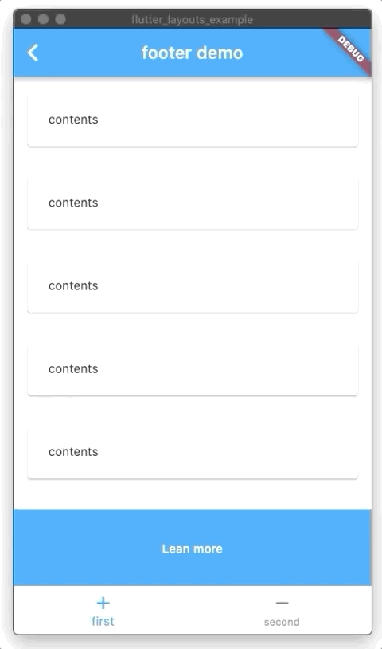

# Footer Layout



## Usage
```dart
Widgete build(BuildContext context){
    return Footer(
      body: buildContent(),
      footer: buildFooter(),
    );
}

// or with scaffold.
Widgete build(BuildContext context){
  return Scaffold(
    // appBar: ~
    body: Footer(
        body: buildContent(),
        footer: buildFooter(),
    ),
    // bottomNavigationBar: ~
  );
}
```

## Usage example
```dart
import 'package:flutter/material.dart';
import 'package:flutter_layouts/flutter_layouts.dart';

class FooterScreen extends StatefulWidget {
  static const routeName = "/demo/footer";

  FooterScreen({Key key}) : super(key: key);

  @override
  _FooterScreenState createState() => _FooterScreenState();
}

class _FooterScreenState extends State<FooterScreen> {
  @override
  Widget build(BuildContext context) {
    return Scaffold(
      appBar: AppBar(
        title: Text("footer demo"),
      ),
      body: buildBody(),
      bottomNavigationBar: BottomNavigationBar(items: [
        BottomNavigationBarItem(icon: Icon(Icons.add), title: Text("first")),
        BottomNavigationBarItem(icon: Icon(Icons.remove), title: Text("second"))
      ]),
    );
  }

  Widget buildBody() {
    return Footer(
      body: buildContent(),
      footer: buildFooter(),
    );
  }

  Widget buildContent() {
    return ListView.builder(
      itemBuilder: (c, i) {
        return Card(
          margin: EdgeInsets.all(16),
          child: Container(
            padding: EdgeInsets.all(24),
            child: Text("contents"),
          ),
        );
      },
      itemCount: 20,
    );
  }

  Widget buildFooter() {
    return Container(
      padding: EdgeInsets.all(24),
      decoration: BoxDecoration(color: Theme.of(context).primaryColor),
      child: FlatButton(
        onPressed: () {},
        child: Text("Lean more", style: Theme.of(context).textTheme.button.copyWith(
          color: Theme.of(context).colorScheme.onBackground
        ),),
      ),
    );
  }
}

```